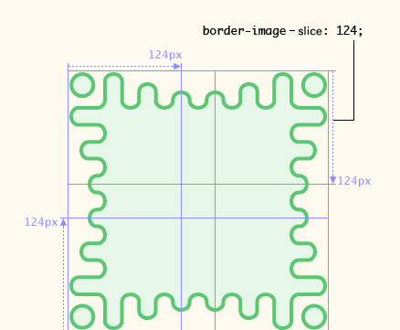

# zadanie-1

Witam serdecznie. Jest 5.03.2016 rok, godzina 12:49. :+1: 
Proces to środowisko, w którym działa program. 

# Wyklad
Wykłady

notatki z wykładu

historia rozwoju internetu http://www.evolutionoftheweb.com/

stronk do ćwiczeń html https://jsfiddle.net

markdown

https://www.firebase.com/
ci
ga do markdown   http://www.asp.katowice.pl/zobacz/markdown

Przydatne informacje do html ( Thinkful HTML – wprowadzenie do HTML i CSS) zjajdziemy do w alapicie linki w repozytorium PSPI 

 ## Zjazd 16.04.2016
 
 
 
  www.polskiklubblendera.pl - to przykładowa strona zrobiona w wordpresie
  żeby zobaczeć zawartość strony to klkammy prawym i wyświetl źródło strony 
  
  w latach 90 strony były wpisywane ręcznie dzisiaj wiele rzeczy jest kopiowane np linki. 
  jednym z przykłądów jest strona www.mat.ug.edu.pl

gotowce na stronie  githubpages
**responsywność** to oznacza że na urządzeniach typu tablet to wygląda to dobrze np się nie rozchodzi

iCloud to strona typu google w której np jest chmura jako miejsce przetrzymywania danych na stronę. 
zainstaluj githubdesktop 

GitLab to kolejna stronka podobna do github ale jest większa prywatność bo można zablokować kopiowanie - klonowanie . 

ściąga

        http://tao.inf.ug.edu.pl/ informacje wykładowcy wbzyl 
        
       http://wbzyl.inf.ug.edu.pl/sp/unix-commands
       
       
 informacje dotyczące **CSS** znajdziemy  <http://wbzyl.inf.ug.edu.pl/rails2/ti>
 
<http://wbzyl.inf.ug.edu.pl/rails2/ti/css-basics>

Jeśli chodzi o Kaskadowe arkusze stylów
Reguła składa się z selektora i deklaracji.

selektor { deklaracje }
Deklaracja składa się właściwości po której następuje dwukropek oraz wartości po której następuje średnik.

właściwość :  wartość ;
Przykład reguły:

body {  
  margin: 28px;  
  background-color: yellow;  
}  
 
 
 # do pracy na zaliczenie dołóżyć ramki 
 https://www.w3.org/TR/css3-border/
 
 
 
 Propozycja strony do tworzenia ramek
 
https://css-tricks.com/

